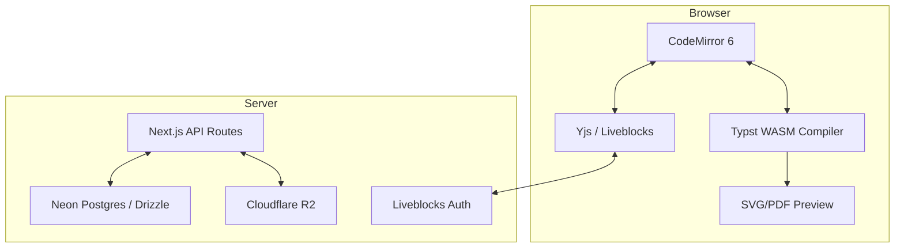

# Typsh - Collaborative Typst Document Editor

**Typsh**는 쉽게 말해 Overleaf의 Typst 버전으로, 브라우저에서 Typst 문서를 작성하고 실시간으로 협업할 수 있는 웹 서비스입니다.

## 🛠 Tech Stack

| 영역 | 기술 |
|------|------|
| **Framework** | Next.js 15 (App Router) |
| **Editor** | CodeMirror 6 + `codemirror-lang-typst` |
| **Collaboration** | Liveblocks + Yjs + `y-codemirror.next` |
| **Typst Engine** | `@myriaddreamin/typst.ts` (Browser WASM) |
| **Auth** | Auth.js (Google + GitHub OAuth) |
| **Database** | Neon Postgres + Drizzle ORM |
| **Storage** | Cloudflare R2 |
| **Styling** | Tailwind CSS v4 + shadcn/ui |

## 🏗 Architecture



## 🏁 Getting Started

### Prerequisites

- [pnpm](https://pnpm.io/) 설치
- Node.js 최신 LTS 버전

### Installation

```bash
git clone https://github.com/csh1668/typsh.git
cd typsh

pnpm install

cp .env.example .env
# .env 파일을 열고 필요한 환경 변수를 입력

pnpm drizzle-kit push

pnpm dev
```

## License

This project is licensed under the [MIT License](LICENSE)

This project uses the following open source software:

- **[typst.ts](https://github.com/Myriad-Dreamin/typst.ts)** by Myriad-Dreamin (Apache-2.0)
